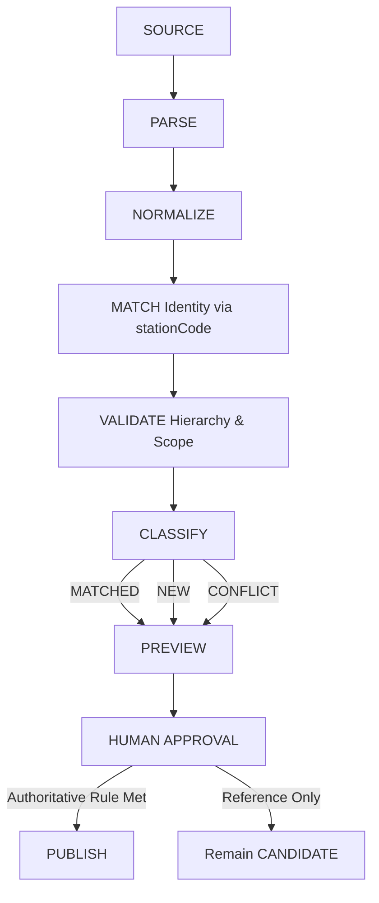

# Multi-Source Station Reconciliation Architecture

## Overview
The Station Reconciliation architecture enforces rigid multi-source merge rules. Primary authoritative records are protected from being overwritten by secondary or open-source datasets.

## Provenance Tracking
Every Station record preserves its origin through:
- `sourceId`: Reference to the registered Source dataset
- `dataVersionId`: Specific version of that source
- `authorityLevel`: (`PRIMARY`, `SECONDARY`, `INFERRED`)
- `verificationStatus`: (`VERIFIED`, `NOT VERIFIED`, `REVIEW_REQUIRED`, `CONFLICT`)

## Conflict Resolution Rules
If `Source A` and `Source B` disagree on a station's attributes (e.g., spelling of `officialName`):
1. **Never Silently Overwrite**: Conflicting data generates a Reconciliation Event.
2. **Authority Priority**:
   - `OFFICIAL_PRIMARY` > `OFFICIAL_PUBLICATION` > `GOVERNMENT_OPEN_DATA` > `SECONDARY_REFERENCE`
3. **Manual Resolution**: If priority cannot resolve it or there is a conflict within the same priority level, the record is flagged as `REVIEW_REQUIRED`.

## Pipeline Flow

